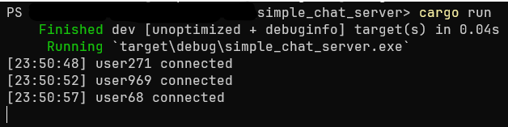
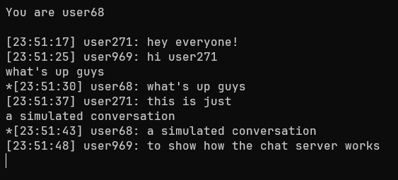

# Project description

This is a simple chat server written in Rust and Tokio where you can open several clients on your terminal, connect to the server, and talk to the other clients
you opened. 

There is a maximum capacity of 5 users/clients. This is an arbitrary number I decided on, as I'm pretty sure it can even accomodate up to 1000 clients and above.
But since you're the only one who can open the clients, and you're most likely manually opening them one by one, and furthermore you're just talking to yourself, 
there is no need to increase the capacity to even just 10 clients. 

# How to run it

First, please make sure that you have [Rust](https://doc.rust-lang.org/book/ch01-01-installation.html) installed. Then make sure you have telnet installed
and enabled on your system. 

Clone the project to your system. Go to the project directory using your terminal, type `cargo run`, and open at least two more terminals and type
`telnet localhost 8080` on them. You should connect to the localhost:8080 server that `cargo run` instantiated, and you can start typing and receiving
messages. 

This program has no graceful shutdown (this may or may not change in the future), so to shut down the server (the following works in powershell, other terminals 
may have different commands), go to the terminal where you typed `cargo run` and press Ctrl + c. To close particular users, press Ctrl + c and type 'quit'.

# Examples

The first image is the server with `cargo run` and the users connecting in order.

The next three images are the users that connected in order and are showing an example conversation in the chat server.

# Problems that I know of

1. it may or may not be worth it to have more robust error handling,
  i.e., get rid of some unwraps and ?. 
  potential fix: look into network code error handling
2. the program has no way to gracefully shutdown once all users
  disconnect. it may be worth it to rectify this in the future.

For a list of possible fixes and other notes, please look at problems_changes_notes.txt

# Possible changes/updates

1. fix problems
2. on the client level, it may or may not be worth it to notify
  users whenever a new user has connected. downside to this is that it
  may make the chat server look bloated with messages. i probably won't
  do this, but i'm still including it here.
3. i might add some testing in the future

# Notes on the project's conception

The inspiration from this project came from a desire to start understanding + working on asynchronous and network programming. A huge chunk of the code comes from
this [video](https://www.youtube.com/watch?v=T2mWg91sx-o), and I added the ability to have unique users that were immediately identifiable in the chat, which is closer to a 
real chat server/app.

# On the project as a precursor to a chat client

I looked at several Rust backend web frameworks such as Axum, Actix and Rocket, and I saw that they were pretty much built on Tokio, which is an asynchronous runtime
crate for Rust. Instead of jumping straight to working with the web frameworks, I wanted to gain a deeper understanding of asynchronous programming first so that I'd have
a good foundation when working with the backend frameworks.

All that to say that I learned a lot about asynchronous programming, and after this project I wanna move on to organically making a simple chat web client. 
